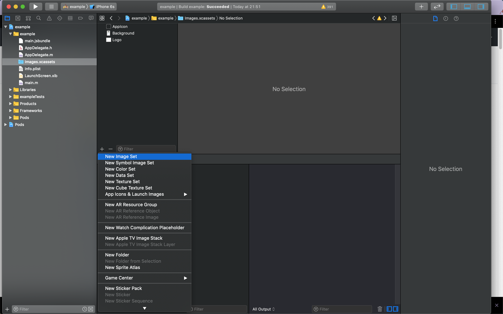
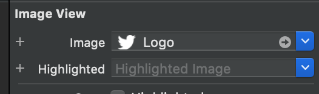
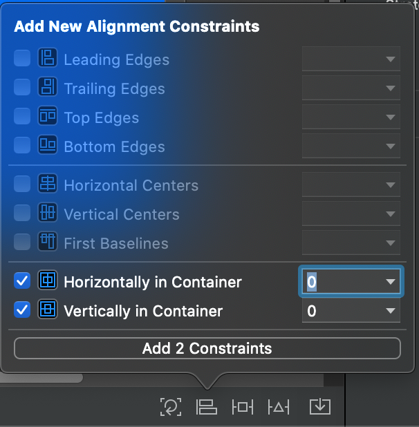
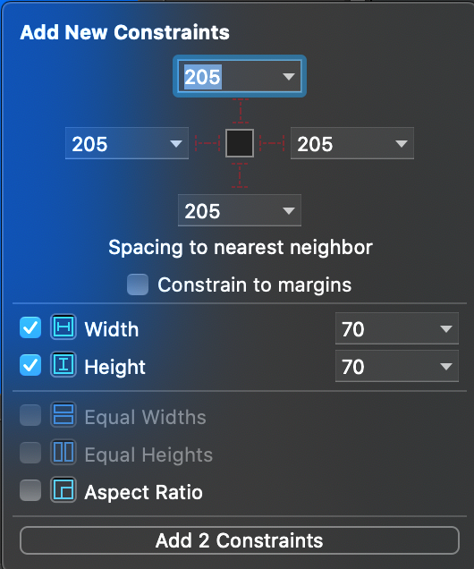
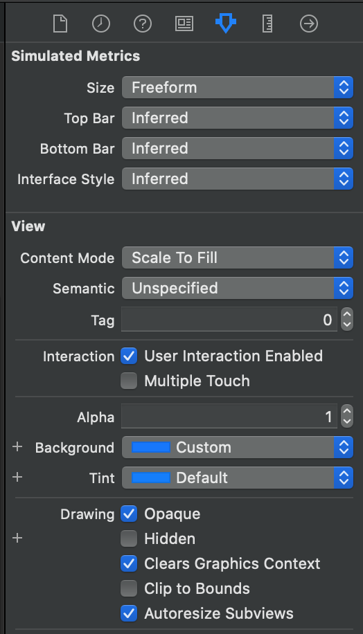
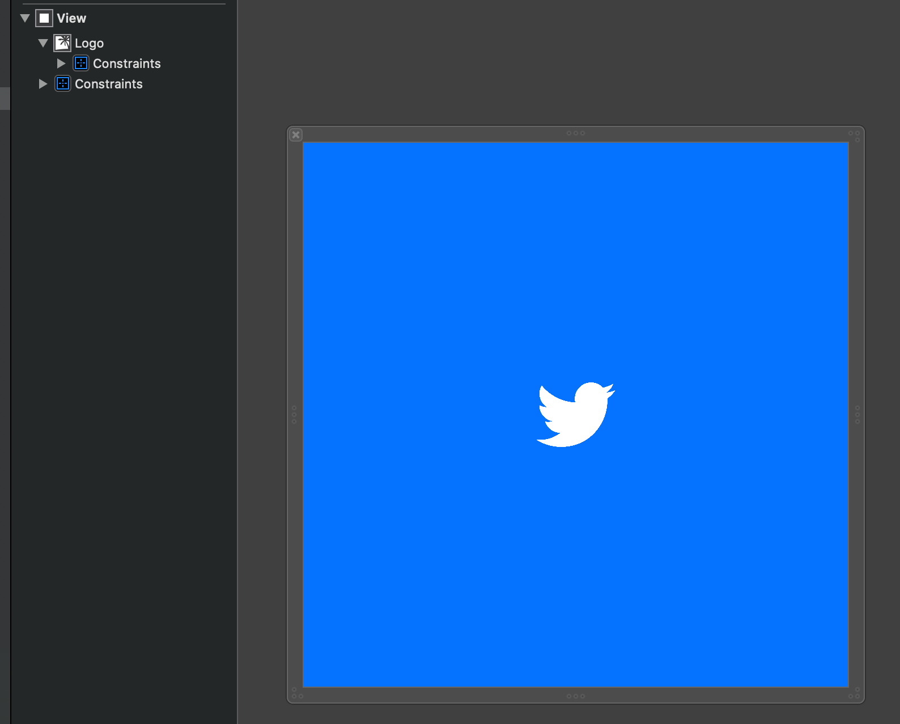

<h1 align="center">
  <div>
    React Native Motion Splash
  </div>
  <div>
  <a href="https://www.npmjs.com/package/react-native-motion-splash" target="_blank">
    
  </a>

  <a href="https://www.npmjs.com/package/react-native-motion-splash" target="_blank">
    
  </a>

  <a href="https://github.com/maitrungduc1410/react-native-motion-splash" target="_blank">
    
  </a>

  <a href="https://github.com/maitrungduc1410/react-native-motion-splash" target="_blank">
    
  </a>
  
  </div>
  <br>
  <h3 align="center">
    A Splash view that animates and reveals its content, inspired by the Twitter splash.
  </h3>
  <div align="center">
    
  </div>
  <h2 align="center">
    If you like this project, encourage me by giving a ⭐️. Happy hacking
  </h2>
</h1>

# Table of Contents
1. [Installation](#Installation)
    1. [iOS](#iOS)
    2. [Android](#android)
2. [Usage](#usage)
    1. [Basic usage](#basic)
    2. [Animation types](#Animation-types)
    3. [Advanced](#Advanced)
3. [Compare with other libraries](#Compare-with-other-libraries)
4. [Demo](#demo)
5. [Thanks](#thanks)

# Installation
With npm:
`$ npm install react-native-motion-splash --save`

With yarn:
`$ yarn add react-native-motion-splash`

## iOS
### First step
First, run the following command to install Pods for iOS:
```
cd ios && pod install
```
Next open your project in Xcode, and add a image set, and set the name for it whatever you want (Eg: in the image below its name is `Logo`). This image will be the main image which will be animated later:



### Second step
Next open `LaunchScreen.xib` to setup a splash screen, this screen will be shown at the very first time when you app runs. First press `CMD + Shift + L` to show list of components, then choose an `Image View` and drag and drop it under the root `View`.

Then select the image view in the hierarchy and set the image for it:

<div align="center">
  
</div>

Next add constraints to the image like so:

<div align="center">


</div>


Next select the root view and set background color for it by selection `Background`:

<div align="center">


</div>

After all you should have this:

<div align="center">
  
</div>

### Third step
Next, open `AppDelegate.m`, and to function `didFinishLaunchingWithOptions` the following right before `return YES`:
```objc
#import "MotionSplash.h"

// Add below lines to didFinishLaunchingWithOptions

UIImage *img = [UIImage imageNamed:@"Logo"]; // the name of your image
CGSize iconInitialSize = CGSizeMake(70, 70); // (width, height) of your icon
NSString *backgroundColor = @"#0573ff";
[MotionSplash initWithIconImage:img iconInitialSize:&iconInitialSize backgroundColor:backgroundColor  inRootView:rootView];
```
Note:
- `iconInitialSize`: must match the size you setup in second step to perform best animation visualization
- `backgroundColor`: should also match the color of the root view you setup in second step in `LaunchScreen.xib` (you can use `Digital Color Meter` built-in on Mac to check Hexa color code)

## Android
Open `android/build.gradle` and set `minSdkVersion` to `21`.

Add you icon to `android/app/src/main/res/mipmap`, you should add the icon to all supported dimensions.

Create `colors.xml` in `android/app/src/main/res/values`. And add the following content:
```xml
<?xml version="1.0" encoding="utf-8"?>
<resources>
    <color name="backgroundColor">#33B5E5</color>
    <!-- you can choose whatever color you want -->
</resources>

```
Next, create `android/app/src/main/res/values/background_splash.xml` with the following content:
```xml
<?xml version="1.0" encoding="utf-8"?>
<layer-list xmlns:android="http://schemas.android.com/apk/res/android">

    <item
        android:drawable="@color/backgroundColor"
        android:gravity="fill" >
    </item>

    <item
        android:id="@+id/logo_splash"
        android:gravity="center"
        android:height="70dp"
        android:width="70dp"
        >
        <bitmap
            android:gravity="fill"
            android:src="@mipmap/logo"
            />
    </item>

</layer-list>
```

Next, open `android/app/src/main/res/values/styles.xml`, and change to following:
```xml
<resources>

    <!-- Base application theme. -->
    <style name="AppTheme" parent="Theme.AppCompat.Light.NoActionBar">
        <!-- Customize your theme here. -->
        <item name="android:textColor">#000000</item>
    </style>


    <!-- Add this section -->
    <style name="SplashTheme" parent="Theme.AppCompat.Light.NoActionBar">
        <item name="android:background">@drawable/background_splash</item>
        <item name="android:windowFullscreen">true</item>
    </style>

</resources>
```
Now add `SplashActivity.java` in `android/app/src/main/java` with the following content:
```java
package com.example;

import androidx.appcompat.app.AppCompatActivity;

import android.content.Intent;
import android.os.Bundle;

public class SplashActivity extends AppCompatActivity {

    @Override
    protected void onCreate(Bundle savedInstanceState) {
        super.onCreate(savedInstanceState);
        Intent intent = new Intent(this, MainActivity.class);
        startActivity(intent);
        finish();

    }
}
```
Next open `MainActivity.java` and add the following:
```java
import com.reactlibrary.MotionSplash;
...
@SuppressLint("ResourceType")
@Override
protected void onCreate(Bundle savedInstanceState) {
  super.onCreate(savedInstanceState);

  Size iconInitialSize = new Size(70, 70);
  String backgroundColor = getResources().getString(R.color.backgroundColor);
  MotionSplash.init(MainActivity.this, R.drawable.background_splash, R.id.logo_splash, iconInitialSize, backgroundColor);
}
```

Finally, open `android/app/src/main/java/AndroidManifest.xml`, and update `applcation` to:
```xml
<application>
  <activity
    android:name=".SplashActivity"
    android:theme="@style/SplashTheme"

    >
    <intent-filter>
        <action android:name="android.intent.action.MAIN" />

        <category android:name="android.intent.category.LAUNCHER" />
    </intent-filter>
  </activity>
  <activity
      android:name=".MainActivity"
      android:configChanges="keyboard|keyboardHidden|orientation|screenSize|uiMode"
      android:label="@string/app_name"
      android:launchMode="singleTask"
      android:windowSoftInputMode="adjustResize">
  </activity>
  ...
....
```
# Usage
## Basic
```js
import MotionSplash from 'react-native-motion-splash'

componentDidMount() {
  MotionSplash.animate() // use Twitter reveal animation as default
}

//or
useEffect(() => {
  MotionSplash.animate()
}, [])
```
## Animation types
There are several of animations you choose from, just pass the animation name into `MotionSplash.animate('animationType')`
### Twitter
Its the default animation that Twitter use for their app. If animationType is not set it will default to this one.

<div align="center">
  
</div>

### HeartBeat
HeartBeat like animation, unlike the other animations, this special animation allows you to continue to animate until a function its called. This could be more entertaining to the user than having a quick launch and waiting on a spinning wheel if the app needs to fetch more data.

To use the Heartbeat animation you should use `MotionSplash.animate('HeartBeat')` as normal and then proceed with your network or background job. When you are done, just call:
```js
MotionSplash.hide()
```
And the splashview should dismiss:

<div align="center">
  
</div>

To set the number of minimum beats per round trip, use:
```js
MotionSplash.setMinimumBeats(3);
```

### Rotate Out
Similar to the Twitter one but rotating while zooming out.
```js
MotionSplash.animate('RotateOut')
```

<div align="center">
  
</div>

### Pop and Zoom Out
Pop the view a couple of times and zoom out.
```js
MotionSplash.animate('PopAndZoomOut')
```

<div align="center">
  
</div>

### Squeeze and Zoom Out
Squeeze the view and zoom out.
```js
MotionSplash.animate('SqueezeAndZoomOut')
```

<div align="center">
  
</div>

### Swing and Zoom Out
Swings the view and zoom out.
```js
MotionSplash.animate('SwingAndZoomOut')
```

<div align="center">
  
</div>

### Wobble and Zoom Out
Wobbles the view and zoom out.
```js
MotionSplash.animate('WobbleAndZoomOut')
```

<div align="center">
  
</div>

## Advanced
### Using background image
If you want to add a background image after the animated icon instead of using background color. Do the following:

Go to `ios/YourProject/AppDelegate.m` and change to:
```objc
UIImage *img = [UIImage imageNamed:@"Logo"];
UIImage *backgroundImage = [UIImage imageNamed:@"Background"]; // NOTE this line, here is the name of your background image
CGSize iconInitialSize = CGSizeMake(70, 70);
[MotionSplash initWithIconImage:img iconInitialSize:&iconInitialSize backgroundImage:backgroundImage  inRootView:rootView];
```

Go to `android/app/src/main/res/drawable/background_splash.xml` and change to the following:
```xml
<?xml version="1.0" encoding="utf-8"?>
<layer-list xmlns:android="http://schemas.android.com/apk/res/android">

  <item
    android:drawable="@color/backgroundColor"
    android:gravity="fill" >
  </item>

  <!-- Your background image here -->
  <item
    android:id="@+id/logo_background"
    android:gravity="center"
  >
    <bitmap
      android:gravity="fill"
      android:src="@mipmap/background"
    />
  </item>

  <item
    android:id="@+id/logo_splash"
    android:gravity="center"
    android:height="70dp"
    android:width="70dp"
  >
    <bitmap
      android:gravity="fill"
      android:src="@mipmap/logo"
    />
  </item>
</layer-list>
```
Then go to `android/app/src/main/java/MainActivity.java` and change like follow:
```java
@SuppressLint("ResourceType")
@Override
protected void onCreate(Bundle savedInstanceState) {
  super.onCreate(savedInstanceState);

  Size iconInitialSize = new Size(70, 70);
  MotionSplash.init(MainActivity.this, R.drawable.background_splash, R.id.logo_splash, iconInitialSize, R.id.logo_background);
}

// Note the "R.id.logo_background" above, that must match the id in the drawable xml
```

Now reload your app to see the change
### Icon tint color
To change the tint color of the animated icon or background image, use the following:
```js
MotionSplash.useCustomColor(true, 'red');
// true will be applied to the animated icon
// false applied for the background image (if set)
```

# Compare with other libraries
- `react-native-boot-splash` requires you to use `Storyboard` for iOS, and their tool is also do some configurations for you in order to make it work (Eg: changing `Info.plist`). So in the future if you don't want to use that library and want to go back to the original structure, it's maybe hard
- on iOS both `react-native-boot-splash` and `react-native-splash-screen` idea is animate the whole splash screen, this make it's impossible in cases you have more than 1 objects on the splash screen and you just want animate the center one (for example)

By creating splash screen manually using native code under the hood, `react-native-motion-splash` have full control of how the splash screen should be shown, how it should be animated. That's why `RNMotionSplash` can perform more animations.

# Demo
A fully working demo is located at [example folder](./example/)

# Thanks
Big thanks to [Pixel16](https://github.com/PiXeL16/RevealingSplashView) of his great work that inspires me to create this library.